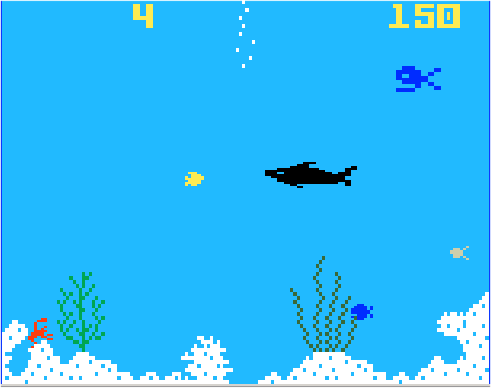

# Projeto-Shark-Shark-
FPRO/LEIC, 2021/22
Vasco Moutinho de Oliveira
1LEIC14
### Objetivo

Criar um clone do clássico Shark!Shark! em Pygame.

### Repositório de código

1) Link para o repositório do GitHub: https://github.com/@author/xxx

2) Adicionar, como colaborador com permissão de leitura (*role read*):

- https://github.com/AfonsoSalgadoSousa
- https://github.com/jlopes60
- https://github.com/nmacedo
- https://github.com/rpmcruz
- https://github.com/eSoares
- https://github.com/pbv
- https://github.com/imdcode
- https://github.com/acoelho-fe-up-pt

### Descrição

*O jogador é um peixe que deve comer peixes mais pequenos para ganhar pontos e vida extra enquanto evita os peixes maiores. Após comer um certo número de peixes o tamanho do jogador vai aumentando, tornando maior a quantidade de peixes que consegue comer. O peixe maior é mais rápido mas é menos ágil, sendo mais dificil desviar-se dos peixes maiores.*

### SHARK!SHARK!

### Pacotes

- Pygame

### Tarefas

1. carregar os níveis
1. desenhar a matriz do nível
1. ler teclas e mover as peças
2. verificar se jogador chegou ao fim do nível

- Atualizado a última vez em 07/12/2021
